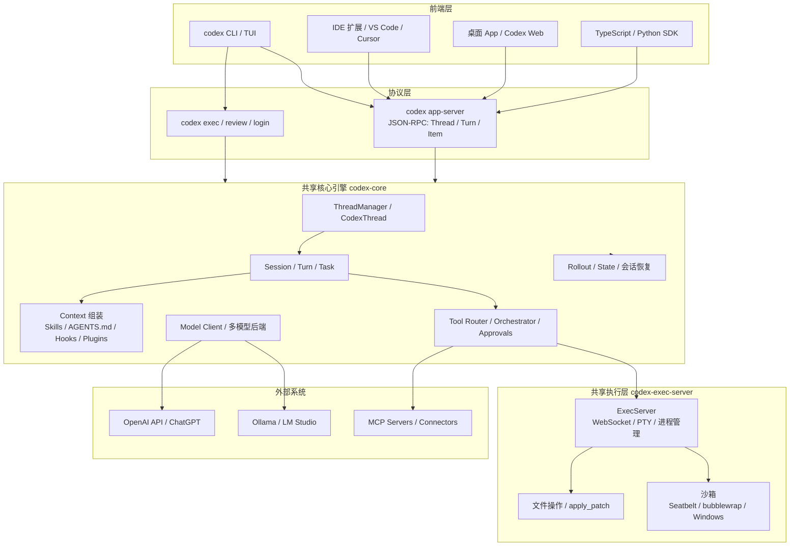
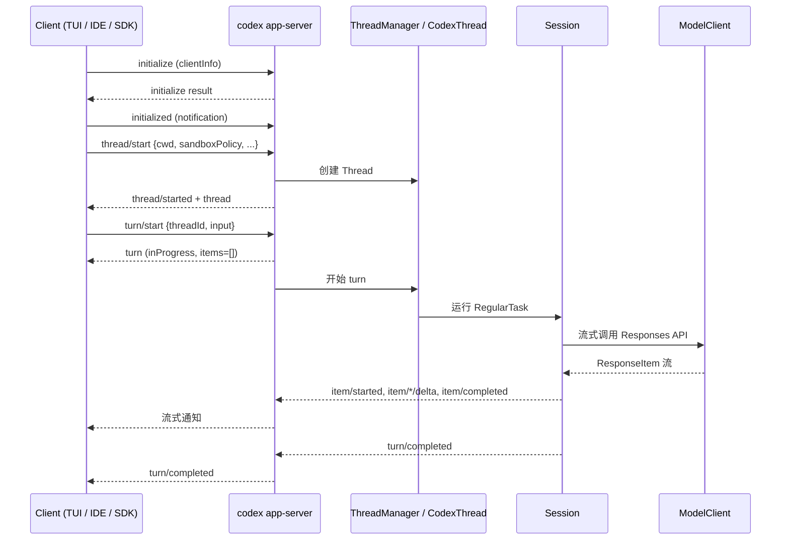
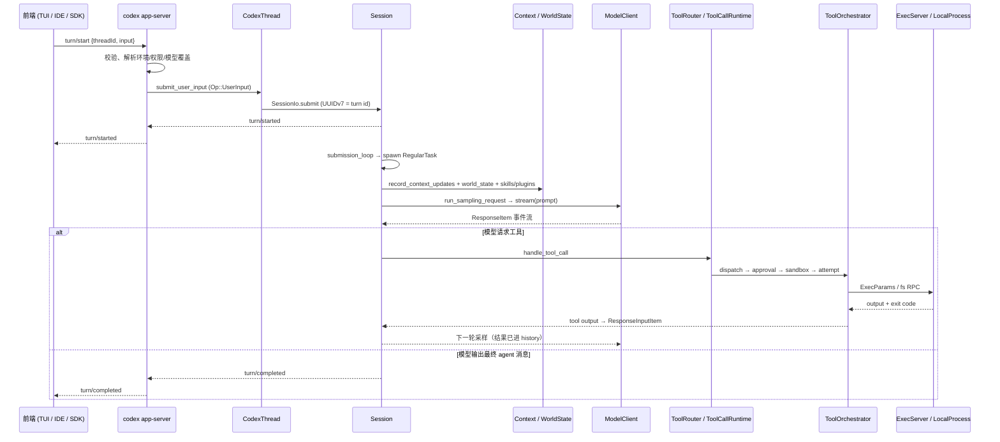

# Codex Agent 知识库

每个模块记录四件事：做什么、什么场景用、和谁交互、关键代码在哪。

## 总体架构



## 分层架构地图

### 第 1 层：前端 / 交互层

| 模块 | 做什么 | 使用场景 | 与下一层交互 | 关键代码 |
| --- | --- | --- | --- | --- |
| `codex-cli` | 顶层入口，解析子命令、统一配置覆盖、分派到 TUI/exec/app-server/login 等 | 所有 `codex` 命令的起点 | 按子命令拉起 TUI、exec 或 app-server | `codex-rs/cli/` |
| `codex-tui` | 全屏交互式终端：流式渲染、审批、diff、编辑器、终端 | 开发者日常交互式会话 | 通过 `codex-app-server-client` 以 in-process JSON-RPC 驱动会话，订阅 item 事件 | `codex-rs/tui/` |
| `codex-exec` | 非交互 CLI：`codex exec`、`codex exec review`、`codex exec resume` | CI、脚本、自动化、代码审查 | 同样走 in-process app-server client，输出 JSONL/最后一条消息 | `codex-rs/exec/` |
| IDE / 桌面 App / Web / SDK | 外部富客户端（VS Code 扩展、桌面 App、TS/Python SDK） | 编辑器内对话、独立桌面、嵌入自己的应用 | 通过 stdio/websocket/unix socket 连接独立 `codex app-server`，走 JSON-RPC | `codex-rs/app-server/README.md` |

### 第 2 层：协议 / 服务层

| 模块 | 做什么 | 使用场景 | 与下一层交互 | 关键代码 |
| --- | --- | --- | --- | --- |
| `codex-app-server` | JSON-RPC 2.0 服务端：`thread/*`、`turn/*`、approvals、auth、MCP、Apps 等请求处理器；stdio/websocket/unix 三种传输 | 所有前端（含 in-process TUI/exec）与 agent 引擎之间的统一入口 | 请求转给 `ThreadManager`/`CodexThread`，事件流回发给客户端 | `codex-rs/app-server/` |
| `codex-app-server-protocol` | Thread/Turn/Item、请求/通知/事件、schema 生成（`generate-ts` / `generate-json-schema`）、experimental API 门控 | 定义外部协议契约，IDE/App/SDK 依赖它 | 只定义类型，由 app-server 实现 | `codex-rs/app-server-protocol/` |
| `codex-app-server-client` | in-process app-server 客户端，封装 bootstrap/handshake/typed channel | TUI 与 exec 复用同一套启动和事件管线 | 直接驱动同进程 app-server runtime | `codex-rs/app-server-client/` |
| `codex-app-server-daemon` | 远程 app-server 生命周期：start/restart/stop/bootstrap | 远程机器（SSH）、桌面/移动端远程管理 | 管理 app-server 进程，不进入 agent 循环 | `codex-rs/app-server-daemon/` |
| `codex-exec-server` + protocol | 进程/PTY/文件系统 RPC 服务：`process/*`、`fs/*`；本地 websocket 或远程 relay | 核心引擎把“跑命令、读写文件”委托给统一执行层 | 被 `UnifiedExec`/tools runtime 调用，返回输出与退出码 | `codex-rs/exec-server/`、`codex-rs/exec-server-protocol/` |
| `codex-protocol` | 共享的内部/外部类型：`EventMsg`、`ResponseItem`、config types、user_input | 核心层与 UI/协议层之间的事件与数据模型 | 被 app-server、core、tui 共同依赖 | `codex-rs/protocol/` |
| `codex-config` | 8 层配置加载：MDM/managed/CLI flags/项目/profile/用户/云端/系统，输出 effective TOML + 来源 | 启动时组装生效配置、配置 UI、严格校验 | 提供 `Config` 给 app-server 和 core | `codex-rs/config/src/loader/` |

### 第 3 层：核心引擎 `codex-core`

| 模块 | 做什么 | 使用场景 | 与下一层交互 | 关键代码 |
| --- | --- | --- | --- | --- |
| `ThreadManager` | 创建/resume/fork/list/archive thread；内存中维护已加载线程；路由 metadata 写线程存储 | app-server 每次会话操作的第一站 | 调 `CodexThread`/`Session`，用 `ThreadStore` 持久化 | `core/src/thread_manager.rs` |
| `CodexThread` | 一条对话线程对象：设置、后台终端、空闲 turn 启动 | 表示用户与 agent 的一次持续对话 | 创建/驱动 `Session`，向 app-server 暴露状态 | `core/src/codex_thread.rs` |
| `Session` | 一次运行中的线程：输入队列、单一运行任务、interrupt、事件发送 | 每个活跃线程对应一个 session | 运行 `RegularTask`/`ReviewTask`/`CompactTask`/用户 shell 任务 | `core/src/session/session.rs` |
| `TurnContext` | 一次 turn 的完整快照：config、model、cwd/environment、权限、审批策略、skills/MCP 上下文 | 每次模型推理前固化本 turn 的所有输入约束 | 供 Context 组装、ModelClient、ToolRouter 使用 | `core/src/session/turn_context.rs` |
| `Context` / `WorldState` | 组装模型可见上下文片段：AGENTS.md、skills、plugins、apps、权限说明、环境、当前时间、token 预算；片段有硬上限、可 diff | 决定“模型这次看到什么” | 产出 `ResponseItem`/fragment 交给 `ModelClient` | `core/src/context/`、`core/src/context/world_state/` |
| `ContextManager` | 增量维护历史、token 估算、截断、compaction 触发 | 控制上下文增长与缓存命中 | 被 Session 调用，产出待发送的模型输入 | `core/src/context_manager/` |
| `Compact` | 上下文超预算时用模型摘要替换历史；支持 pre/post hooks | 长会话自动压缩 | 生成 compacted items 写回历史并通知 UI | `core/src/compact.rs` |
| `ModelClient` | 流式 Responses API 调用、重试、WebSocket prewarm、compact/memory summarize 客户端 | 每次模型采样 | 通过 `codex-api`/`codex-client` 调 provider | `core/src/client.rs`、`codex-rs/codex-api/` |
| `ModelProvider` | provider 抽象：ChatGPT 托管/API key/Bedrock；本地 Ollama/LM Studio | 多后端模型接入 | 统一给 `ModelClient` 提供 auth、请求、流式响应 | `codex-rs/model-provider/`、`codex-rs/ollama/`、`codex-rs/lmstudio/` |
| `Tools` | ToolRouter（模型可见工具清单）、ToolOrchestrator（approval→sandbox→run→retry）、approvals、handlers、runtimes、registry | 工具调用生命周期 | 把模型工具调用映射到具体执行 runtime，再委托 ExecServer/MCP/Connector | `core/src/tools/` |
| `UnifiedExec` | 交互式进程：PTY 生命周期、输出缓冲上限、后台终端 | shell、长命令、后台任务 | 通过 `ExecServerClient` 调 exec-server | `core/src/unified_exec/` |
| `Guardian` | 自动审批评审：压缩 transcript 后交给专门 reviewer，超时/失败 fail-closed | 高信任自动审批场景 | 在 approvals 阶段替代/辅助用户审批 | `core/src/guardian/` |
| `Hooks` | 生命周期钩子：PreToolUse/PostToolUse/PermissionRequest/SessionStart/End/UserPromptSubmit/SubagentStart/Stop/PreCompact/PostCompact/Stop | 企业策略、观测、自定义拦截 | 在工具/会话/压缩事件前后回调外部命令或 plugin | `codex-rs/hooks/`、`core/src/hook_runtime.rs` |
| `Skills` | 技能发现/加载/注入/隐式调用识别 | 让模型按需加载领域知识 | 注入 skill instructions 到 Context | `codex-rs/skills/`、`core/src/skills.rs` |
| `Plugins` | 插件包：skills + MCP servers + hooks + connectors + apps；marketplace/install | 扩展 Codex 能力 | 展开成 skills/MCP/hooks 等能力注入 | `codex-rs/plugin/`、`core/src/plugins/` |
| `MCP` | MCP client runtime 与 tool catalog；`codex mcp-server` 让 Codex 反向外露为 MCP server | 接入外部 MCP 工具/资源；或把 Codex 工具暴露给其他客户端 | 把 MCP tools 映射进 ToolRouter | `codex-rs/codex-mcp/`、`codex-rs/mcp-server/`、`codex-rs/rmcp-client/` |
| `Connectors` / Apps | Codex Apps 连接器：外部 App（GitHub 等）以 tool 形式接入，含认证与运行时缓存 | 让 agent 操作外部产品 | 通过 connectors runtime 生成工具并回调外部 API | `codex-rs/connectors/`、`codex-rs/ext/connectors/`、`core/src/apps/` |
| `Memories` | 两阶段记忆管线：Phase 1 从 rollout 抽取记忆，Phase 2 全局整合 | 长期记忆/跨会话上下文 | 会话启动时后台执行，产出 memory artifacts | `codex-rs/memories/`、`core/src/memories/` |
| `Agent` / multi-agent | 子 agent spawn/control/status、agent 间消息、parent/child 拓扑 | 复杂任务拆分子 agent | 通过 `spawn_agent`/`send_message` 工具创建子线程并管理生命周期 | `core/src/agent/`、`codex-rs/ext/agent/`、`codex-rs/agent-graph-store/` |
| `State / Rollout / ThreadStore` | JSONL rollout + SQLite state DB + ThreadStore 抽象；resume/fork/archive | 会话持久化、恢复、历史查询 | 被 ThreadManager/LiveThread/Session 调用 | `codex-rs/rollout/`、`codex-rs/state/`、`codex-rs/thread-store/` |
| `Sandboxing / ExecPolicy` | 权限 profile、平台沙箱 transform、execpolicy 前缀规则 | 决定命令能不能跑、能读/写哪里 | 在 ToolOrchestrator 里选择沙箱并 transform ExecRequest | `codex-rs/sandboxing/`、`codex-rs/execpolicy/`、`core/src/sandboxing.rs`、`core/src/exec_policy.rs` |
| 可观测性 | analytics、OTel tracing、rollout-trace | 诊断、用量、事后复盘 | 横切整个 core 与协议层 | `codex-rs/analytics/`、`codex-rs/otel/`、`codex-rs/rollout-trace/` |

### 第 4 层：执行 / 安全层

| 模块 | 做什么 | 使用场景 | 与上一层交互 | 关键代码 |
| --- | --- | --- | --- | --- |
| `codex-exec-server` | 启动/读取/写入/终止进程，PTY，文件系统 RPC | 所有 shell、后台进程、文件读写 | 接收 core 的 `process/*`、`fs/*` 请求；远程模式通过 relay 注册环境 | `codex-rs/exec-server/` |
| 平台沙箱 | macOS Seatbelt、Linux bubblewrap/Landlock、Windows restricted-token/elevated backend | 按平台执行 read-only/workspace-write/full-access 策略 | 把 `SandboxTransformRequest` 转成带沙箱的 `ExecRequest` | `codex-rs/sandboxing/`、`codex-rs/linux-sandbox/`、`codex-rs/windows-sandbox-rs/` |
| 底层工具 | PTY、apply_patch、file-system、shell-command、git-utils | 执行细节 | 被 exec-server 和 tools runtime 复用 | `codex-rs/utils/pty/`、`codex-rs/apply-patch/`、`codex-rs/file-system/` |

### 第 5 层：外部系统

| 系统 | 做什么 | 场景 | 入口 |
| --- | --- | --- | --- |
| OpenAI Responses API / ChatGPT | 模型推理、compaction、memory summarize | 默认模型后端 | `codex-api`、`codex-client` |
| Ollama / LM Studio | 本地开源模型 | 离线/本地推理 | `codex-rs/ollama/`、`codex-rs/lmstudio/` |
| MCP servers / Connectors / Web Search / Image Generation | 外部工具、资源、搜索、图片生成 | 扩展能力 | `codex-mcp`、`connectors`、`ext/` |

## 层间交互（核心链路）

- 前端 → app-server：JSON-RPC（`thread/start`、`turn/start`、事件订阅）。
- app-server → core：`ThreadManager` → `CodexThread` → `Session`，把外部请求变成一次 turn。
- core → 模型：`TurnContext` + `Context/WorldState` → `ModelClient` → `ModelProvider` → Responses API，流式返回 `ResponseItem`。
- core → 工具：模型产生 tool call → `ToolRouter` → `ToolOrchestrator`（hooks → approval/Guardian → sandbox）→ runtime → `UnifiedExec`/`ExecServer` 或 MCP/Connector。
- core → 持久化：`LiveThread`/`ThreadStore` 把 canonical history 写 rollout，metadata 写 SQLite state。
- core → 扩展：skills/plugins/AGENTS.md/hooks/memories 在 Context 组装与生命周期事件中注入。

## 分层与进程边界（部署形态）

四层是逻辑/代码边界，不是进程边界；实际落在几个进程里，取决于入口形态。

| 场景 | 进程形态 | 说明 |
| --- | --- | --- |
| 本地 TUI / `codex exec` | 1 个 `codex` 进程 | 前端、in-process app-server、core、本地执行层都在同一进程；模型 API 走网络，不产生新进程 |
| IDE 扩展 / 桌面 App / SDK | 2 类进程 | 前端在宿主进程（VS Code、App、你的程序）；协议层+核心层+本地执行层在 `codex.exe` app-server 进程；二者用 JSON-RPC 跨进程 |
| 远程环境 | 本地 + 远端 | 本地是前端+app-server+core；远端是独立 exec-server 进程，通过 relay/websocket 连回 |
| `codex app-server daemon`（Unix） | daemon + updater + app-server | 远程管理形态；Windows 尚未支持 |

真正的跨进程/跨机器边界：

- 前端 ↔ app-server：JSON-RPC（stdio / websocket / unix socket）。
- app-server ↔ 模型 API：HTTP / WebSocket（网络）。
- app-server ↔ MCP server：通常每个连接一个子进程。
- app-server ↔ 远程 exec-server：relay / websocket。
- 每次 shell/PTY 命令：临时子进程；沙箱 helper（bwrap / sandbox-exec / Windows hidden helper）和 hooks 命令也是按需短命进程。

注意：Guardian 自动审批不是独立进程，是 app-server 内部的一个子 agent session，只是多调用一次模型。

## 建议学习路线

| 顺序 | 主题 | 必读入口 | 交付物 |
| --- | --- | --- | --- |
| 1 | 全局地图（本次） | app-server README、exec-server README、core/src/lib.rs | 分层架构图 + 模块表 |
| 2 | 协议层 | app-server README 全文、app-server-protocol、app-server-client、exec-server-protocol | Thread/Turn/Item 时序图 |
| 3 | 核心循环 | thread_manager → codex_thread → session → tasks → context → tools → unified_exec → exec-server | 一次 turn 的完整调用链图 |
| 4 | 横向能力与安全 | skills、plugin、codex-mcp、mcp-server、connectors、hooks、memories、sandboxing、execpolicy、guardian、model-provider | 扩展机制与安全边界对照表 |
| 5 | 持久化与恢复 | rollout、state、thread-store、compact、resume/fork | 状态模型与恢复流程 |
| 6 | 多智能体与 Apps | core/src/agent、ext/agent、agent-graph-store、apps、connectors | spawn/control/status 机制图 |
| 7 | 团队分享 | KNOWLEDGE.md 全量 | 分享文档、讲稿、对比维度表 |

## 核心设计思想

- 把 agent 的每一步建模为 `Thread / Turn / Item` 数据流。
- UI、协议、核心引擎、执行层分层解耦。
- 上下文是显式且有上限的 context fragments。
- 工具、权限、扩展能力都做成可插拔组件。
- 执行通过统一 exec 抽象，支持本地进程与远程环境。

## 一次 turn 的完整链路

1. 用户在 TUI 输入消息。
2. TUI 通过 `codex-app-server-client` 发 `turn/start`。
3. `codex-app-server` 收到 JSON-RPC 请求，交给 `ThreadManager`。
4. `CodexThread` 创建 `Session` 和 `TurnContext`。
5. `Context` 组装系统提示、Skills、AGENTS.md、工具说明、权限说明。
6. `ModelClient` 调用模型，流式返回 `ResponseItem`。
7. 模型产生工具调用，进入 `ToolRouter` 和 `Orchestrator`。
8. 需要审批时先走 `Approvals`，再交给执行 runtime。
9. 执行 runtime 调用 `ExecServer`，在沙箱里跑进程或改文件。
10. 执行结果回到模型上下文，继续下一轮推理，直到 turn 完成。
11. `Rollout` 持久化会话，TUI 持续流式渲染。

## 模块记录模板

```text
## 模块：xxx

职责：

使用场景：

与相邻层交互：

关键文件：

一句话总结：
```

## 技术架构

### 技术栈

| 维度 | 选型 |
|------|------|
| 语言 | Rust（agent 引擎），TS/Python 仅为外部 SDK |
| 构建 | Cargo workspace（80+ crate）+ Bazel |
| 异步运行时 | Tokio（多线程 work-stealing） |
| 序列化 | serde + JSON-RPC 2.0 |
| 持久化 | SQLite（rollout state）+ Tantivy（全文搜索）+ 文件系统（config/cache） |
| 模型协议 | OpenAI Responses API（流式 HTTP），兼容 Ollama/LM Studio/DeepSeek |
| 沙箱 | macOS Seatbelt / Windows unelevated / Linux bubblewrap |

### 进程模型

```
+----------+  +----------+        +----------+  +----------+  +------+
|   TUI    |  |   exec   |        | VS Code  |  | Desktop  |  | SDK  |
+----+-----+  +----+-----+        +----+-----+  +----+-----+  +--+---+
     |             |                   |              |           |
     | in-process  |                   |     stdio / websocket / unix socket
     v             v                   v              v           v
+-----------------------+   +------------------------------------------+
|  app-server-client     |   |  codex app-server（独立进程）              |
|  +-------------------+ |   |  +------------------------------------+ |
|  | app-server        | |   |  | JSON-RPC 2.0 handler              | |
|  | runtime（同进程）   | |   |  | (thread/* / turn/* / approvals…)   | |
|  | typed channel     | |   |  +------------------+-----------------+ |
|  +--------+----------+ |   +---------------------+-------------------+
|           |            |                         |
+-----------+------------+                         |
            |          +----------------------------+
            v          v
        +-------------------+
        |    codex-core      |
        |  ThreadManager     |
        |  Session / Turn    |
        |  ModelClient       |
        |  ToolRouter        |
        |  WorldState        |
        +---------+----------+
                  |
     +------------+------------+
     v                         v
+------------------+    +----------------------+
| 子进程：shell/cmd  |    | MCP servers（子进程）   |
| 沙箱隔离执行       |    |  stdio / ws 通信       |
+------------------+    +----------------------+
```

- TUI / exec 通过 `app-server-client` 在同进程内启动 app-server runtime，用 typed channel（非 stdio）直接驱动 core。
- IDE / Desktop / SDK 连接独立 `codex app-server` 进程，走真正的 JSON-RPC over stdio/ws/socket。
- 多个会话共享一个进程和 Tokio runtime，模型请求异步不阻塞其他会话。
- 工具执行 spawn 独立沙箱子进程。

### Crate 分层

```
+-------------------------------------+
| Entry: cli / tui / exec / app-server |
+-------------------------------------+
| Protocol: app-server-protocol/client |
|           app-server-daemon/transport |
+-------------------------------------+
| Core: core / core-api / core-skills  |
|       core-plugins                    |
+-------------------------------------+
| Exec: exec-server / shell-command    |
|       shell-escalation / sandboxing   |
+-------------------------------------+
| Extensions: ext/skills ext/mcp       |
|  ext/connectors ext/guardian         |
|  ext/memories ext/agent ext/web-search|
+-------------------------------------+
| Models: plugin / skills / hooks      |
|         connectors / codex-mcp /     |
|         mcp-server / config          |
+-------------------------------------+
| Infra: login / analytics / rollout   |
|  http-client / model-provider        |
|  ollama / lmstudio / file-search     |
+-------------------------------------+
```

依赖方向：Infra ← Models ← Extensions/Exec ← Core ← Protocol ← Entry。上层依赖下层，下层不感知上层。

### 一次 Turn 运行时数据流

```
turn/start
  → required_mcp_servers_for_input（算 MCP 依赖）
  → capture_step_context（StepContext 快照）
  → build_world_state（WorldState 组装：system prompt / skills / hooks /
      permissions / environments / plugins）
  → build_skills_and_plugins（注入点名 skills 的 SKILL.md + plugins 的 MCP/App 清单）
  → hooks: UserPromptSubmit / PreToolUse
  → build_model_request → ModelClient.stream（HTTP POST → SSE 流）
      ├── agentMessage → 推前端
      ├── tool_call → ToolRouter.dispatch → ToolOrchestrator:
      │   approval（hook → Guardian → 用户）→ sandbox 子进程 → 结构化结果
      └── loop until 模型不再请求工具
  → hooks: PostToolUse / Stop
  → rollout 持久化（SQLite + Tantivy 索引）
  → turn/completed
```

### 扩展模型对比

| 扩展 | 接入点 | 运行时形态 | 生命周期 |
|------|--------|-----------|---------|
| Skills | prompt 注入（SKILL.md） | 模型按需读文件 | 文件存在即生效 |
| Plugins | 四路展开进 Skills/MCP/Apps/Hooks | 启动加载，config 控制 | install/upgrade/sync |
| MCP servers | ToolContributor + config | 子进程 stdio/ws | 按需启动/停止 |
| Hooks | 11 个生命周期事件 | 外部命令 JSON io | 配置声明，事件触发 |
| Extensions | ExtensionRegistry trait | 同进程 Rust trait impl | 编译链接，启动注册 |

> 上方的总体架构图是 **逻辑架构**（分层视图），本节是 **技术架构**（语言 / 进程 / crate / 数据流）。两张图互补：逻辑架构讲 design philosophy，技术架构讲 how it actually works。

## 数据架构

Codex 的持久化采用 **JSONL（canonical）+ SQLite（index/projection）+ session_index（name lookup）+ ThreadStore trait（abstraction）** 四层模型。

### 存储全景

```
$CODEX_HOME/
+-- sessions/
|   +-- rollout-2025-05-07T17-24-21-<uuid>.jsonl    ← 会话回放数据
|   +-- rollout-2025-05-07T17-24-21-<uuid>.jsonl.zst ← 冷压缩
+-- archived_sessions/
|   +-- <same structure>                              ← 归档会话
+-- session_index.jsonl                               ← 名称 → ID 映射
+-- state_5.sqlite                                    ← 线程元数据/配置/goals
+-- logs_2.sqlite                                     ← 事件日志
+-- goals_1.sqlite                                    ← goal 状态
+-- memories_1.sqlite                                 ← 记忆产物
+-- thread_history_1.sqlite                           ← JSONL 字节偏移投影
```

### 第 1 层：JSONL Rollout（canonical source of truth）

- 路径：`sessions/rollout-<ISO8601>-<uuid>.jsonl`，归档移入 `archived_sessions/`
- 格式：每行一条 `RolloutItem` JSON（`codex-rs/rollout/src/recorder.rs`），可用 `jq` / `fx` 直接查看
- 写入：`RolloutRecorder` 后台 writer task（mpsc channel），`Create` 模式建新文件、`Resume` 模式追加已有文件
- 过滤策略（`policy.rs`）：并非所有 item 都落盘，筛选 `ResponseItem`、`InterAgentCommunication`、`EventMsg`、`Compacted`、`TurnContext`、`WorldState`、`SessionMeta` 等
- 压缩：后台 worker（`compression.rs`）将冷文件压缩为 `.jsonl.zst`（Zstandard）；读取时透明解压（`RolloutLineReader` 自动处理 `.jsonl` 和 `.jsonl.zst` 两种格式）

### 第 2 层：SQLite 索引（结构化查询）

- `state_5.sqlite`：线程元数据（title、cwd、source、model、创建/更新时间）、config、external agent imports、goals
- `logs_2.sqlite`：运行事件日志
- `goals_1.sqlite`：goal 状态持久化
- `memories_1.sqlite`：记忆产物（两阶段管线产出）
- `thread_history_1.sqlite`：**JSONL 字节偏移投影**（`projection_state`）——记录 `thread_id → next_rollout_byte_offset + next_rollout_ordinal`，将 JSONL 的 ordinal 映射为文件字节偏移，支持 O(1) 按 turn/item 跳转
- 连接参数：WAL journal mode、auto-vacuum、synchronous=NORMAL、sqlx pool
- 启动时 `state_db::init()` 打开/创建各 DB，执行 migrations，然后 backfill（扫描 JSONL 补全 SQLite 元数据）

### 第 3 层：Session Index（名称快速映射）

- 文件：`session_index.jsonl`（`rollout/src/session_index.rs`）
- 格式：`SessionIndexEntry { id: ThreadId, thread_name, updated_at }`
- 写入：append-only，最后写入覆盖同名 entry；随线程重命名/删除时更新
- 读取：`find_thread_name_by_id` 从文件末尾反向扫描，取最新匹配

### 第 4 层：ThreadStore Trait（统一抽象）

- `ThreadStore` trait（`thread-store/src/store.rs`）定义所有持久化操作的 trait 接口：
  - 写入：`create_thread` / `resume_thread` / `append_items` / `persist_thread` / `flush_thread` / `shutdown_thread` / `discard_thread`
  - 读取：`load_history` / `load_latest_model_context` / `list_items` / `list_turns` / `search_threads` / `search_thread_occurrences`
  - 管理：`archive_thread` / `delete_thread` / `move_thread_to_section` / `update_thread_metadata` / `prepare_fork` / `create_fork`
- `LocalThreadStore` 实现：内存中维护 `LiveThread`（active writer handle + locks），底层对接 JSONL + SQLite
- `InMemoryThreadStore`：测试用无持久化实现

### Agent Graph Store（多 agent 拓扑）

- `agent-graph-store/`：独立存储线程的 parent/child 关系（哪个线程 spawn 了哪个子代理）
- `ThreadSpawnEdgeStatus`：跟踪 spawn 状态（in_progress / completed / failed）

### Model Context 重建

- `load_latest_model_context`：从 `thread_history_1.sqlite` 投影读取 byte offset → 从 JSONL 精确读取最新几条 turn 的 item → 重构模型可见上下文
- `ModelContextScan`：带进度回调的 JSONL 流式扫描

### 搜索

- 全文搜索：调用 `rg`（ripgrep）对 `sessions/*.jsonl` 做 `--fixed-strings --ignore-case` 匹配，再对压缩文件做行级 fallback 扫描（`rollout/src/search.rs`）
- 名称搜索：`session_index.jsonl` 反向扫描

### 写入链路（一次 turn 的持久化视角）

```
core Session
  → RolloutRecorder (mpsc channel)
    → 后台 writer task
      → JSONL 文件 append
      → LiveWriter 标记脏页
  → ThreadStore::append_items
    → 同时更新 LiveThread 内存状态
    → persistence_metrics 测量/filter
  → ThreadStore::persist_thread
    → SQLite thread_history 更新 byte offset
    → state_db 更新 metadata
    → session_index 更新名称（如需要）
```

### 关键设计决策

- **JSONL 是 source of truth**，SQLite 是索引/投影。即使 SQLite 丢失，JSONL 可以完整回放所有会话。
- **压缩不与写入耦合**：热文件保持 `.jsonl`，后台异步压缩。
- **ThreadStore trait 隔离存储实现**：未来若需支持远程存储（如 S3），只需新增 ThreadStore impl。
- **byte offset 投影避免了 JSONL 全量扫描**：O(1) 跳转到任意 turn 的首条 item。

## 阶段 1：产品与运行模型

### 前端入口对照

| 入口 | 启动方式 | 使用场景 |
| --- | --- | --- |
| 终端 TUI | `codex` 或 `codex "prompt"` | 开发者在终端里做交互式 agent 会话 |
| 非交互 CLI | `codex exec "prompt"` | CI、脚本、自动化流水线里调用 agent |
| IDE 扩展 | VS Code / Cursor / Windsurf 插件 | 在编辑器内对话、改代码、看 diff |
| 桌面 App | `codex app` | macOS/Windows 上的独立桌面体验 |
| Codex Web | 浏览器访问 chatgpt.com/codex | 云端 agent，不在本仓库内运行 |
| TS/Python SDK | `new Codex()` / `from openai_codex import Codex` | 把 agent 嵌入自己的应用或工作流 |

### 平台支持

| 入口 | 平台 |
| --- | --- |
| CLI / TUI | macOS 12+、Ubuntu 20.04+/Debian 10+、Windows 11 via WSL2（源码构建）；发布包也提供 Windows x64/arm64 原生 MSVC 二进制 |
| IDE 扩展 | 随 IDE 平台：VS Code 等支持 macOS/Linux/Windows |
| 桌面 App | macOS、Windows |
| Codex Web | 浏览器/云端 |
| SDK | 跟随 Codex CLI；TS 需要 Node.js 18+，Python 需要 Python 环境 |

### 常用命令速查

- `codex`：交互式 TUI
- `codex exec`：非交互执行
- `codex review`：非交互代码审查
- `codex login` / `codex logout`：登录管理
- `codex mcp` / `codex mcp-server`：MCP 管理或作为 MCP server
- `codex plugin`：插件管理
- `codex app-server`：启动 app-server，供 IDE/App/SDK 对接
- `codex app`：启动桌面 App（macOS/Windows）
- `codex resume` / `codex fork` / `codex archive`：会话恢复、分支、归档
- `codex doctor`：诊断本机安装、配置、认证、运行健康

### CLI 与 TUI 的区别

- CLI 是“命令行接口”这个大类，`codex` 二进制本身就属于 CLI，它接收参数和子命令。
- TUI 是 CLI 里的“交互式全屏终端界面”，由 `codex-tui` crate 实现，`codex` 默认进入。
- `codex` 无子命令：进入 TUI，持续渲染、可输入、可审批、可看流式输出。
- `codex exec`：非交互 CLI，一条命令跑完就退出，适合脚本和 CI。
- 所以不是两个 agent，而是同一 agent 的两种交互形态。

### exec 非交互模式

- `codex exec [PROMPT]` 启动一个非交互会话，跑完即退出。
- 常用参数：`--json` 输出 JSONL 事件、`--output-last-message` 保存最后一条消息、`--output-schema` 约束模型输出结构、`--ephemeral` 不落盘、`--skip-git-repo-check` 允许非 Git 目录、`--strict-config` 严格校验配置。
- 子命令：`codex exec resume` 恢复会话，`codex exec review` 做代码审查。
- 源码入口：`codex-rs/exec/src/cli.rs`。
- 场景：CI、脚本、自动化流水线、把 agent 嵌入应用。

### 配置分层

配置加载由 `codex-rs/config/src/loader/` 负责，最终得到一个“合并后的有效 TOML + 每个 key 的来源”。

优先级从高到低：

1. MDM 下发的 managed config
2. `managed_config.toml`
3. CLI / session flags
4. 项目配置 `.codex/config.toml`
5. 用户 profile 配置
6. 用户配置 `config.toml`
7. 企业托管云端配置
8. 系统配置 `/etc/codex/config.toml` 或 Windows 系统路径

高优先级覆盖低优先级；被禁用的 layer 会保留给 UI 展示，但不会参与有效配置合并。

### 沙箱模式

- `SandboxMode` 枚举见 `codex-rs/protocol/src/config_types.rs`：
  - `read-only`：默认，只读沙箱
  - `workspace-write`：允许写工作区
  - `danger-full-access`：完全访问，需显式开启
- 策略选择与命令转换在 `codex-rs/sandboxing/` crate：
  - macOS：Seatbelt
  - Linux：bubblewrap / Landlock
  - Windows：restricted-token 或 elevated backend
- `ExecRequest` 携带 `PermissionProfile`、网络策略、Windows 沙箱级别等，交给统一执行层。
- `codex exec` 有 `--dangerously-bypass-approvals-and-sandbox` 全局参数，默认不开启。

## 阶段 2：数据模型与协议层

### 核心抽象：Thread / Turn / Item

`codex app-server` 把一次交互建模成三个层级：

| 抽象 | 含义 | 关键字段（v2 协议） |
| --- | --- | --- |
| Thread | 一条用户与 Codex 的持续会话，包含多个 turn，可持久化/恢复/分支 | `id`(UUIDv7)、`sessionId`、`status`、`cwd`、`modelProvider`、`turns[]`、`ephemeral`、`forkedFromId`、`parentThreadId` |
| Turn | 一轮对话：通常从用户输入开始，到 agent 消息/工具执行完成结束 | `id`、`status`(completed/interrupted/failed/inProgress)、`items[]`、`error`、`startedAt`、`completedAt`、`durationMs` |
| Item | turn 内用户输入与 agent 产出的最小持久化单元，也是 UI 流式渲染的最小单位 | `userMessage`、`agentMessage`、`reasoning`、`plan`、`commandExecution`、`fileChange`、`mcpToolCall`、`collabAgentToolCall`、`webSearch`、`contextCompaction` 等 |

### ThreadItem 类型速查

- `userMessage`：`id`、`clientId`、`content`（text / image / localImage / audio / localAudio）。
- `agentMessage`：`id`、`text`、`phase`、`memoryCitation`。
- `reasoning`：`id`、`summary[]`、`content[]`。
- `plan`：`id`、`text`（计划模式）。
- `commandExecution`：`id`、`command`、`cwd`、`status`、`commandActions[]`、`aggregatedOutput`、`exitCode`、`durationMs`。
- `fileChange`：`id`、`changes[{path, kind, diff}]`、`status`。
- `mcpToolCall`：`id`、`server`、`tool`、`status`、`arguments`、`result`/`error`、`readOnlyHint`。
- `collabAgentToolCall` / `subAgentActivity`：多 agent 的 spawn/send/wait/close 等。
- 其他：`webSearch`、`imageView`、`sleep`、`imageGeneration`、`enteredReviewMode`、`exitedReviewMode`、`contextCompaction`。

类型定义见 `codex-rs/app-server-protocol/src/protocol/v2/item.rs`。

### app-server 生命周期

1. 每个连接先 `initialize`（携带 `clientInfo`），再发 `initialized` 通知；未初始化前其他请求都会被拒绝。
2. 用 `thread/start` 新建会话，或 `thread/resume` 恢复，`thread/fork` 从历史分支出新线程；成功后返回 Thread 并收到 `thread/started` 通知。
3. `turn/start` 立即返回 `turn`（`status: inProgress`、`items: []`），随后服务器发 `turn/started` 通知表示真正开始运行。
4. 运行期间持续收到通知：`item/started` → 各类 delta（如 `item/agentMessage/delta`、`item/commandExecution/outputDelta`）→ `item/completed`；工具/文件变更也以 Item 呈现。
5. 结束时有 `turn/completed`（`completed` / `interrupted` / `failed`）；失败时带 `error`。
6. 可 `turn/interrupt` 中断；`thread/unsubscribe` 停止订阅，最后一个订阅者离开且 30 分钟无活动后 `thread/closed`。

### 传输方式与 in-process 差异

- 独立 app-server：默认 stdio（JSONL）；实验性 websocket；unix socket；`--listen off` 关闭。
- TUI 与 `codex exec` 不额外起进程：通过 `codex-app-server-client` 在进程内启动 app-server runtime，用 typed channel 通信，但仍保持 JSON-RPC 语义（响应信封、通知、背压）。
- IDE 扩展、桌面 App、SDK 连接独立进程的 app-server，因此协议层是“所有前端共享 agent 引擎”的关键。

### 一次 turn 的协议时序



工具调用是同一个时序的延长：模型发出工具调用后，`Session` 产生 `commandExecution`/`fileChange`/`mcpToolCall` 等 Item，通过 `ToolOrchestrator` 审批并执行，执行输出再以 delta/`item/completed` 流回 UI。

### 关键文件

- `codex-rs/app-server/README.md`：协议全文、API、事件、approval、auth、Apps。
- `codex-rs/app-server-protocol/src/protocol/v2/thread_data.rs`：Thread / Turn 类型。
- `codex-rs/app-server-protocol/src/protocol/v2/item.rs`：ThreadItem 类型。
- `codex-rs/app-server-protocol/src/protocol/v2/turn.rs`：turn/start 参数与 TurnStatus。
- `codex-rs/app-server-protocol/src/protocol/v2/thread.rs`：thread API 与 ThreadStatus。
- `codex-rs/app-server-client/README.md`：in-process client。
- `codex-rs/app-server-protocol/src/protocol/event_mapping.rs`：核心 `EventMsg` → app-server 通知的映射。
- `codex-rs/exec-server/README.md`：进程/文件系统执行协议。

一句话总结：所有前端共享同一套 JSON-RPC 契约，Thread 管会话边界，Turn 管一轮推理，Item 是持久化且可流式的对话/执行单元。

## 阶段 3：核心 agent 循环

目标：追踪一次 turn 从输入到执行的完整调用链。

### 一次 turn 的端到端调用链

1. 前端发 `turn/start {threadId, input}` 给 app-server。
2. `TurnRequestProcessor` 校验输入、解析环境/权限/模型覆盖，加载 `CodexThread`，构造 `Op::UserInput`。
3. `CodexThread.submit_user_input_with_client_user_message_id` 把 op 提交给 `SessionIo`，生成 UUIDv7 `submission_id`（对外就是 turn id），`turn/start` 立刻返回。
4. `Session` 的 `submission_loop` 收到 `Op::UserInput`，`spawn_task(RegularTask, TurnContext)` 开始真正运行，随后 app-server 才发 `turn/started`。
5. `run_turn` 先做 pre-sampling compact、解析输入所需的 MCP servers、`capture_step_context` 生成 `StepContext`，再记录 context updates / world state，注入 skills/plugins，跑 hooks。
6. 进入采样循环：`sess.clone_history().for_prompt(...)` 组装模型输入 → `run_sampling_request` → `ModelClient.stream`（Responses API，HTTP 或 WebSocket）→ 收到 `ResponseItem` 事件流。
7. 若模型输出的是工具调用，`ToolCallRuntime.handle_tool_call` → `ToolRouter` → `ToolRegistry` → 具体 `CoreToolRuntime` → `ToolOrchestrator`（approval → sandbox → attempt → retry）。
8. shell / unified-exec 类工具最终到 `Environment` 后端：本地默认 `LocalProcess`/`LocalFileSystem`（同进程），远程才走 `ExecServerClient` RPC。
9. 工具输出变成 `ResponseInputItem` 写回历史，循环回到第 6 步继续采样；模型不再请求工具并产出最终 agent 消息后，turn 完成，发 `turn/completed`。

### 模块职责速查（阶段 3 重点）

| 模块 | 职责 | 关键点 |
| --- | --- | --- |
| `ThreadManager` | 线程生命周期：start/resume/fork/list/archive；加载线程到内存 | 所有 `thread/*` 请求的第一站 |
| `CodexThread` | 一条线程的对外句柄：提交用户输入、steer、inject、后台终端 | 把 `Op` 转给 `SessionIo` |
| `Session` | 运行中线程：`submission_loop`、输入队列、单一 running task、中断、事件发送 | 同一时间至多一个任务；`cancellation_token` 控制中断 |
| `TurnContext` | 一次 turn 的配置/模型/权限/环境快照 | turn 期间基本不变 |
| `StepContext` | 一次 sampling request 的可变快照：环境、MCP 绑定、工具清单、ToolRouter | 每次采样重新捕获，保证“广告的工具 = 可执行的工具” |
| `Context` / `WorldState` | 组装模型可见 fragment：AGENTS.md、skills、plugins、权限说明、时间、token 预算；diff 渲染 | 有硬上限；片段都必须实现 fragment trait |
| `ContextManager` | 增量维护历史、token 估算、截断 | 控制缓存命中与上下文增长 |
| `ModelClient` | 流式 Responses API，HTTP/WebSocket，重试与 fallback | 一次 turn 内复用 `ModelClientSession`（连接、sticky routing） |
| `ToolRouter` | 模型可见工具规格 + 工具注册表 + dispatch | 每个 step 的 `tool_router` 是最终执行依据 |
| `ToolOrchestrator` | approval → sandbox 选择 → attempt → denial 时升级重试（不重复审批） | 所有 runtime 共享一条执行管线 |
| `Approvals` / `Guardian` | 用户审批 / 自动审批 reviewer | Guardian 是内部子 agent session，不是独立进程 |
| `UnifiedExec` | 交互式 PTY 进程、后台终端、输出缓冲上限 | 本地用 `LocalProcess`，远程用 `RemoteProcess` |
| `ExecServer` | 进程/PTY/文件系统 RPC；本地 in-process 或远程 relay | 本地默认无独立进程 |
| `Rollout` / `ThreadStore` | JSONL 历史 + SQLite 元数据持久化 | 每个 item 都可能落盘，支持 resume/fork |

### 完整调用链图



### 关键设计点

- 一次 turn ≠ 一次模型请求：模型 → 工具 → 结果 → 再模型的循环会重复多次，直到模型不再请求工具。
- Context 是增量、显式、有上限的：禁止无界注入，单 fragment 有大小上限，模型可见内容必须经过组装与校验。
- 工具执行统一走一条管线：hooks → approval（缓存/用户/Guardian）→ sandbox → attempt → denial 后按策略升级重试，且不重复审批。
- 本地默认不启动独立 exec-server 进程：`Environment::local` 直接使用 `LocalProcess`/`LocalFileSystem`；只有远程环境才通过 `ExecServerClient` 走 RPC。
- 每轮 sampling 的 `StepContext` 固定了环境、MCP 连接和工具清单，避免“广告的工具”和“执行时能用的工具”不一致。

### 关键文件

- `core/src/thread_manager.rs`：线程生命周期与内存注册表。
- `core/src/codex_thread.rs`：线程对外句柄与 op 提交。
- `core/src/session/mod.rs`、`session/session.rs`：submission loop、任务调度、中断。
- `core/src/session/turn.rs`：`run_turn` 主循环、采样、item 解析。
- `core/src/session/turn_context.rs`、`session/step_context.rs`：turn 与 step 快照。
- `core/src/context/`、`context/world_state/`：模型可见上下文。
- `core/src/client.rs`：ModelClient 流式调用。
- `core/src/tools/`：router、orchestrator、approvals、runtimes、registry。
- `core/src/unified_exec/`、`exec-server/`：进程执行与 RPC。

## 阶段 4：横向能力与安全

### 4.1 总览：三类扩展的定位

Codex 的横向能力都建立在同一个核心循环上，不新增 agent 进程或循环，而是通过“上下文注入 + 生命周期拦截 + 能力包聚合”三种方式接入：

| 机制 | 本质 | 一句话定位 | 主要使用场景 |
| --- | --- | --- | --- |
| Skills | 指令包（SKILL.md） | 给模型“按需读说明书” | 告诉模型特定任务怎么做；`$SkillName` 或文本点名触发；运行技能自带脚本、读参考资料 |
| Plugins | 能力包（manifest 声明） | 把 skills/MCP/apps/hooks 打包成一个可安装可管理的单元 | 从 marketplace 或本地安装一个能力集；`plugin://` 或 `@plugin` 点名后按需启用其 MCP/技能 |
| Hooks | 生命周期拦截器（外部命令） | 在工具执行与会话生命周期关键点插桩 | 企业策略、审计、命令改写、权限自动决策、压缩前清理、会话收尾通知 |

### 4.2 Skills：指令注入

职责与场景：
- 技能是 `SKILL.md` + frontmatter 的指令包，可选 `agents/openai.yaml` 提供 interface/dependencies/policy 元数据。
- 场景：模型需要领域说明书、规范、模板或脚本；用户用 `$SkillName` 点名；任务匹配技能描述时按策略允许隐式调用。
- 本质：技能不改变模型的能力上限，而是改变“行为分布”——把通用模型的自由发挥约束成符合领域规范的工作流；相当于给 agent 一份可复用的 SOP/操作手册（正文规则 + references 参考资料 + scripts 可执行脚本 + assets 模板）。
- 效果：按正确流程走（模式/工具选择、先后顺序），按正确脚本执行（不重敲代码），按正确输出规范交付（路径、命名、格式），并把团队/领域知识以低成本按需注入上下文。

代码结构：
- `codex-rs/skills/`：共享模型 + 系统技能安装器
  - `SkillMetadata`：name/description/interface/dependencies/policy/path_to_skills_md/scope/plugin_id
  - `SkillPolicy.allow_implicit_invocation`（默认 true）+ products 产品门控
  - `install_system_skills`：把 `src/assets/samples/*` 内置技能写到 `CODEX_HOME/skills/.system`，marker fingerprint 避免每次启动重装
- `codex-rs/core-skills/`：发现、加载、渲染、注入、服务
  - `SkillsService`：按 cwd 和 config 双缓存快照，限制并发根扫描（8），支持额外根目录；`bundled_skills_enabled=false` 时卸载内置技能
  - 加载：解析 SKILL.md frontmatter（name/description/short-description）+ `agents/openai.yaml`；扫描深度 6、每根最多 2000 个技能目录、名称 <=64、描述 <=1024
  - `SkillLoadOutcome`：技能列表 + 禁用路径 + 每个技能归属的文件系统（远程环境通过 ExecutorFileSystem 读）
  - `render.rs`：把技能目录渲染成 `## Skills` 上下文片段，预算默认 8000 字符或上下文窗口 2%；超预算截断描述并给 warning
  - `injection.rs`：`collect_explicit_skill_mentions`（结构化 Skill 输入 + 文本 `$name` 扫描）→ `build_skill_injections` 读完整 SKILL.md 正文 → 作为 `<skill>` user 片段注入，同时打 analytics

技能来源（skill roots，`core-skills/src/loader.rs`）：
- 内置系统技能：`CODEX_HOME/skills/.system`（当前快照内置 6 个：imagegen、openai-docs、plugin-creator、review-agent、skill-creator、skill-installer）
- 用户技能（兼容旧位置）：`$CODEX_HOME/skills`；新位置：`$HOME/.agents/skills`
- 仓库技能：项目 config 目录 `.codex/skills`，以及项目根到 cwd 之间的 `.agents/skills`（按目录逐层探测）
- 管理员技能：系统 config 目录 `/etc/codex/skills`（Unix）
- 插件技能根：插件 manifest 声明的 skills 目录，带 plugin identity/namespace，按递归扫描

“目录 vs 正文”两级注入：
- 一开始（thread-start / 每轮初始 context）只把“目录”放进 prompt：每个技能一行 name + description + 来源定位，受预算限制（默认 8000 字符，或模型上下文窗口的 2%），超出就截断描述、丢弃部分技能并给 warning；目录只含 enabled 且 policy 允许隐式调用的技能。
- SKILL.md 正文一开始不加载；只有当用户输入里出现 `$SkillName`、结构化 skill 选择或可消歧的纯文本点名时，才读取正文并以 `<skill>` 片段注入。

写入时机与内容（`core/src/session/mod.rs::build_initial_context_with_world_state`）：
- 时机：每次 turn 的第一次 sampling 之前，由 `record_context_updates_and_set_reference_context_item` 在缺少 reference_context_item 基线时注入完整初始上下文；auto-compact 开新上下文窗口时也会重建并再次注入。
- 条件：`include_skill_instructions`（默认 true）且扩展未通过 `HostSkillsCatalogInWorldState` 提供目录。
- 内容：把 enabled 且允许隐式调用的技能渲染为 `- name: description (file: path)` 行，按 System < Admin < Repo < User 排序；alias 渲染时额外输出 `### Skill roots`（`- r0 = root` 表）并改用相对路径。

与核心循环交互：
1. Session 初始化 `warm_plugins_and_skills_for_session_init` 预热快照；TurnContext 构建时 `plugins_for_config → effective_plugin_skill_roots → skills_service.snapshot_for_config`，快照放进 `turn_skills`。
2. 上下文构建阶段把技能目录渲染进 developer 消息（`AvailableSkillsInstructions`）。
3. turn 开始时 `required_mcp_servers_for_input` 解析技能声明的 MCP 依赖；`build_skills_and_plugins` 把被点名的 SKILL.md 全文注入，并处理依赖 MCP server 未启用时的提示/安装。
4. 隐式调用：`detect_implicit_skill_invocation_for_command` 根据技能脚本/文档路径识别，只打指标，不注入正文。

关键设计点：
- “目录先给、正文按需”的 progressive disclosure：模型先看到技能清单（名字 + 描述），点名后才注入 SKILL.md 全文，控制上下文成本。
- 技能正文通过所属环境（本地或远程）的 ExecutorFileSystem 读取，避免跨环境路径绕过。
- 技能可声明 dependencies（如需要某个 MCP server），turn 装配时提前把依赖 server 拉起来。

### 模型怎么“取用”技能：识别与联动链

两条通道：模型侧执行 + 宿主侧识别
- 模型侧：目录注入时同时附上 `SKILLS_HOW_TO_USE_*` 使用指令（`core-skills/src/render.rs`）。规则：用户用 `$SkillName` 或纯文本点名，或任务与描述匹配，就必须使用该技能；先完整读完 SKILL.md 再动手；多技能取最小集合并说明顺序；不得把“读/解释技能指令”委托给 subagent。
- 宿主侧：代码在“用户输入 → 首次 sampling”之间做显式识别和正文注入，在工具执行路径上做隐式调用记账。

模型侧怎么读技能（两种资源形态）
- `file` 类技能：SKILL.md 在宿主文件系统，模型用常规文件读取工具打开目录里的路径；`references/scripts/assets` 按 SKILL.md 的路由读取，优先直接运行/修改脚本而不是重敲代码。
- `environment resource` / `orchestrator resource` 类技能：不能当本地路径读，必须调 `skills.list` / `skills.read`。这两个工具由独立 skills 扩展（`ext/skills/`）以 ToolContributor 注册（`tools/list.rs`、`tools/read.rs`）；按 authority（executor/orchestrator）+ package + main_resource 定位，分页读取，单响应上限 512KB，并受所属环境文件系统权限约束。

宿主侧显式识别：用户点名 → 注入正文
- 解析：`core-skills/src/injection.rs::collect_explicit_skill_mentions`。输入可以是结构化 `UserInput::Skill { name, path }`，也可以是文本里的 `$SkillName` / `[$name](path)` mention；路径命中优先，纯文本名只有在技能名全局唯一且不与同名 connector 冲突时才选中；disabled 路径直接排除；按技能列表原序去重。
- 时机：`core/src/session/turn.rs` 首次 sampling 前，`required_mcp_servers_for_input` 先算技能声明的 MCP 依赖，`capture_step_context_with_required_mcp_servers` 保证 step 里 MCP 可用，`build_skills_and_plugins` 做正文注入。
- 注入：`build_skill_injections` 用技能所属环境的 ExecutorFileSystem 读完整 SKILL.md，包成 `SkillInstructions`（`<skill>` user 片段）写入对话历史再进第一次模型请求；同时打 `codex.skill.injected` 指标和 analytics。
- MCP 依赖：`core/src/mcp_skill_dependencies.rs::maybe_prompt_and_install_mcp_dependencies` 收集 `dependencies.tools[].type == 'mcp'` 的缺失 server，可自动写入全局 MCP 配置并拉起，或向用户提问安装。

宿主侧隐式识别：命令命中技能资源 → 记账
- `core/src/skills.rs::maybe_emit_implicit_skill_invocation` 在 shell/exec 工具执行前调用；`core-skills/src/invocation_utils.rs::detect_implicit_skill_invocation_for_command` 按“技能 scripts 目录”和“SKILL.md 路径”建索引，识别 `python skill/scripts/foo.py` 或 `read .../SKILL.md` 这类行为。
- 只发指标、analytics，并通知 SkillInvocationContributor（skills 扩展用于 shadow selection 实验），不注入正文。

新扩展路径与旧核心路径并存
- `app-server/src/extensions.rs` 与 `cli/src/main.rs` 都安装 `codex_skills_extension`（`ext/skills/`），它通过 ThreadLifecycle/Prompt/TurnInput/Tool/SkillInvocation contributors 接管目录渲染、正文注入和 `skills.list/read` 工具；core 用 `HostSkillsCatalogInWorldState` 标记避免目录重复注入。
- 一句话总结：目录是“广告”，SKILL.md 是“说明书”。模型按指令主动读说明书（file 用文件工具、resource 用 skills.* 工具）；宿主在用户点名时替模型预读并注入正文；执行路径上再做隐式调用统计。

### 4.3 Plugins：能力包

职责与场景：
- 插件是声明式能力包：一个 manifest（`plugin.json`）声明 skills、MCP servers、apps、hooks 四类组件。
- 场景：安装一个“带技能 + MCP + 应用连接”的完整能力；企业统一分发；推荐与发现插件。

代码结构：
- `codex-rs/plugin/`：共享包模型
  - `PluginId = plugin_name@marketplace_name`（ASCII 白名单校验），配置与缓存目录都用它
  - `PluginManifest<Resource>`：name/version/description/paths{skills,mcp_servers,apps,hooks}/interface；Resource 泛型让“宿主机路径”和“环境 URI”共用一套模型
  - `ResolvedPlugin`：只解析不激活的“惰性描述符”，校验所有资源路径必须位于包根之下（`ResourceOutsideRoot`）
  - `LoadedPlugin<M>`：加载后的运行时视图（skill_roots、mcp_servers、apps、hook_sources、错误）
  - `PluginLoadOutcome`：有效技能根、有效 MCP、有效 apps、有效 hook 来源 + 能力摘要
- `codex-rs/core-plugins/`：实现层
  - `PluginsManager`：按 CODEX_HOME 单例；`PluginStore`（plugins/cache + plugins/data）；市场管理（openai-curated 等）、远程目录同步、安装/卸载/升级、推荐插件、tool-suggest、telemetry
  - `ExecutorPluginProvider`：通过执行环境的 ExecutorFileSystem 解析包，manifest 发现路径固定列表
  - loader：`load_plugin_skills`（复用 skills 加载器，带 plugin identity/namespace）、`load_plugin_hooks`（manifest 路径/inline，或默认 `hooks/hooks.json`）、`load_plugin_mcp_servers`、`load_plugin_apps`

与核心循环交互：
1. TurnContext 构建：`plugins_for_config`（有缓存 key + generation）→ 得到 trusted_plugin_roots、effective_plugin_skill_roots、plugin_skill_snapshots。
2. 上下文：插件推荐（feature 开启时）作为 contextual user 片段；“插件本身不直接调用，而是展开成其 skills/MCP/apps”。
3. turn 开始：`required_mcp_servers_for_input` 解析 `plugin://` / `@plugin` 点名 → 确保对应 MCP server 可用；`build_skills_and_plugins` 把点名插件的说明（可用 MCP/apps/技能前缀）注入 developer 片段。
4. Hooks：`plugin_hooks_for_layer_stack` 把插件内 hooks 合并进 Hooks 引擎。
5. MCP/Connectors：`effective_mcp_servers`、`effective_apps` 分别喂给 MCP runtime 和 connectors；subagent 通过 `codex_delegate.rs` 共享父会话的 plugins_manager。

关键设计点：
- 插件是“聚合层”，不是新的执行体：它不运行自己的 agent 循环，只是把四类能力装进一个可管理的包。
- 双重边界：解析时校验资源在包根内；运行时按环境（本地/远程）的 ExecutorFileSystem 访问；产品门控在“准入”时做，运行期信任已准入的 CODEX_HOME。
- 能力摘要只对 active（enabled 且无 error）插件生成，描述被清洗并限长，避免污染模型上下文。

### 4.3.1 插件是什么：manifest 与四类组件

- 实体：一个包含 `.codex-plugin/plugin.json`（或兼容 `.claude-plugin/`、`.cursor-plugin/`、根级 `plugin.json` 的 agent-plugin schema；`utils/plugins/src/plugin_namespace.rs`）的目录，本质是“能力聚合清单”，不运行自己的 agent 循环。
- `PluginManifest<Resource>`（`plugin/src/manifest.rs`）：name / version / description / keywords + `paths{skills,mcp_servers,apps,hooks}` + `interface`（display_name / short_description / capabilities / icons / screenshots / default_prompt）。Resource 泛型让“宿主机绝对路径”和“解析后的 authority-bound locator”共用一套模型；所有资源路径校验必须位于包根内（`ResourceOutsideRoot`）。
- 四类组件与缺省目录约定：
  - skills：`paths.skills`，缺省 `skills/`；加载时带 PluginIdentity + `plugin_namespace = manifest.name`，技能列表里显示前缀 `plugin_name:`（`AvailablePluginsInstructions`，`core/src/context/available_plugins_instructions.rs`）
  - MCP servers：`paths.mcp_servers` 可为 Path（配置文件）或 Object（内嵌 JSON），缺省 `.mcp.json`
  - Apps：`paths.apps`，缺省 `.app.json`，解析为 `AppDeclaration{name, connector_id}`（`plugin/src/lib.rs`）
  - Hooks：`paths.hooks` 可为 Paths 或 Inline（内嵌 `HooksFile`），缺省 `hooks/hooks.json`
- `PluginCapabilitySummary`（`plugin/src/lib.rs`）：config_name / display_name / description / has_skills / mcp_server_names / app_connector_ids；只对 enabled 且无 error 插件生成，描述清洗限长。

### 4.3.2 来源、存储与配置

- `PluginId = plugin_name@marketplace_name`（ASCII 白名单：字母数字 `_` `-`；`plugin/src/plugin_id.rs`）
- 存储（`core-plugins/src/store.rs`）：`CODEX_HOME/plugins/cache/<marketplace>/<plugin>/<version>`（默认 version `local`）；数据 `CODEX_HOME/plugins/data/<plugin>-<marketplace>`
- 来源：marketplace（发现路径 `.agents/plugins/marketplace.json`、`.claude-plugin/marketplace.json`、`.cursor-plugin/marketplace.json`；内置名 `openai-curated` / `openai-api-curated` / `openai-bundled` / `openai-primary-runtime`；`core-plugins/src/marketplace.rs`）；插件源 Local path / Git（url + ref + sha）/ Npm（package + version + registry）/ 远程 remote bundle（remote_plugin_id + 安装元数据 `.codex-remote-plugin-install.json`）
- `MarketplacePluginPolicy`：installation（NOT_AVAILABLE / AVAILABLE / INSTALLED_BY_DEFAULT）+ authentication（ON_INSTALL / ON_USE）+ products 产品门控
- 配置（`config/src/config_toml.rs:445`）：`[plugins.name]` = `enabled` + `mcp_servers` 策略覆盖（per-server enabled、批准模式、enabled/disabled tools、per-tool approval）；transport 归插件 manifest 所有，用户只控制启用与策略
- CLI：`codex plugin add/list/remove` + `codex plugin marketplace add/list/upgrade/remove`（`cli/src/plugin_cmd.rs`）

### 4.3.3 加载链路（骨架，后续细化）

- `PluginsManager`（`core-plugins/src/manager.rs`，CODEX_HOME 单例，`PluginsConfigInput` = config layer stack + model provider + plugins_enabled + remote_plugin_enabled + base_url + http_client）→ `PluginStore` → `load_plugins_from_layer_stack` → `LoadedPlugin<McpServerConfig>`（root / skill_roots / mcp_servers / apps / hook_sources / error）→ `PluginLoadOutcome`（能力摘要 + 四类有效 roots）
- 核心侧 TurnContext：`plugins_for_config`（cache key + generation）→ trusted_plugin_roots + effective_plugin_skill_roots + plugin_skill_snapshots；技能加载器把它们作为额外 skill roots（带 plugin identity/namespace），MCP/Apps/Hooks 分别喂给对应子系统。
- plugin hooks 通过 `plugin_hooks_for_layer_stack` 合并进 Hooks 引擎。

### 4.3.4 模型怎么“用”插件：识别与注入联动

- **插件目录（广告）**：`PluginsInstructionsState`（`core/src/session/world_state.rs:176`）在 world state 构建时按 `plugins_available()` 注入 `AvailablePluginsInstructions`（`core/src/context/available_plugins_instructions.rs`）developer 片段：`## Plugins` + 使用规则（技能前缀 `plugin_name:` / MCP 标识 `mcp__server__tool` / 显式点名即优先 / 插件不直接调用而是用其底层能力 / 缺失能力时说明 fallback）。

- **提及解析**：`core/src/plugins/mentions.rs::collect_explicit_plugin_mentions`（夹在 `required_mcp_servers_for_input` 里调用）：
  - 结构化输入 `UserInput::Mention { path: plugin://foo }` + 文本里的 `@plugin` 链接（PLUGIN_TEXT_MENTION_SIGIL=`@`，不用 `$`）
  - `tool_kind_for_path` 识别 `ToolMentionKind::Plugin` → `plugin_config_name_from_path` 提取 config_name → 与 `loaded_plugins.capability_summaries()` 按 config_name 匹配

- **MCP 依赖联动**：`required_mcp_servers_for_input` 中，收集到的 `mentioned_plugins` 的 `mcp_server_names` 全部加入 `required_servers` → `capture_step_context_with_required_mcp_servers` 保证 step 里这些 MCP server 在线运行。

- **能力说明注入**：`build_skills_and_plugins` → `build_plugin_injections`（`core/src/plugins/injection.rs`）：
  - 对每个被点名的插件，按 `plugin_display_names` 过滤 `mcp_tools`（排除 CODEX_APPS_MCP）+ `available_connectors`（过滤 is_enabled 且 plugin_display_names 匹配）
  - `render_explicit_plugin_instructions`（`core/src/plugins/render.rs`）：列出 `MCP servers: server1, server2`、`Apps: AppName`、`Skills from this plugin are prefixed with name:` → 包装成 `PluginInstructions`（developer 角色，无 type marker）→ 作为 `ResponseItem` 在第一轮 sampling 前写入对话历史
  - 注：即使 apps 被正常隐藏，只要 `mentioned_plugins` 非空就会加载 MCP tools 来描述插件可用能力

- **技能前缀联动**：插件 skills 加载时带 `plugin_namespace = manifest.name`（`core-plugins/src/loader.rs:1021`），`core-skills/loader.rs:640` 把命名空间前置于技能名（如 `browser:control-in-app-browser`），与 `AvailablePluginsInstructions` 里的 `plugin_name:` 说明对应。

- **遥测**：`track_plugin_used` analytics（`turn.rs:834`）。

- 一句话总结：插件目录告诉模型“有哪些插件”，提及 `plugin://`/`@plugin` 后宿主注入该插件的“可用 MCP + Apps + 技能前缀”说明，同时确保关联的 MCP server 已在线，模型随后通过这些底层能力完成任务。

### 4.3.5 安全边界与信任模型

Codex 插件有五层安全边界：

**第一层：路径包含（结构安全）**
- `ResolvedPlugin::from_environment`（`plugin/src/provider.rs`）在构造时用 `environment_resource` 校验每个资源路径 `starts_with(root)`，不通过返回 `ResourceOutsideRoot`。
- 脚本归属解析（`core-plugins/src/script_attribution.rs`）额外做 `normalized_relative_script_path`：拒绝任何 `..`、平台前缀、绝对路径组件（`is_safe_plugin_relative_path`），只得到 `/` 分隔的纯相对路径。

**第二层：Marketplace 来源策略**
- `MarketplacePolicy`（`core-plugins/src/marketplace_policy.rs`）从 `ConfigRequirements` 读取企业/管理员要求的 `restrict_to_allowed_sources`：
  - 允许的来源：Git URL 精确匹配、Git 主机正则、本地路径精确匹配
  - `validate_install`：安装前校验 marketplace 路径属于已配置的 source
  - `project_effective_user_config`：删掉配置中不在允许名单里的 marketplace 和插件条目
  - `allowed_configured_marketplace_names` / `configured_plugins_from_stack`：只返回被允许的
- 安装安全（`marketplace_add/install.rs`）：`ensure_marketplace_destination_is_inside_install_root` 做规范化路径检查、`safe_marketplace_dir_name` 清洗目录名；Git clone 设 `GIT_TERMINAL_PROMPT=0`。

**第三层：TrustedPluginRoots（运行时信任）**
- `TrustedPluginRoots`（`script_attribution.rs`）定义哪些插件根属于“受信任的一手代码”：
  - OpenAI-curated（SHA 校验的 startup sync 缓存 + marketplace 插件清单校验）
  - Remote bundle（active version != local 且存在 remote_plugin_id）
  - 本地自定义路径：永远不被信任
- 用于命令归属分析（telemetry tagging），不是执行拦截；但只有受信任根下的脚本才能被带着 plugin identity 上报。

**第四层：远程分发安全**
- 远程插件身份（`remote_plugin_id_resolver.rs`）：`RemotePluginIdResolver` 通过后端同步快照或本地持久化 `.codex-remote-plugin-install.json` 元数据将本地 `PluginId` 映射为后端 `remote_plugin_id`；`RemotePluginScope` 校验 marketplace 属于远程范畴。
- Bundle 下载（`remote_bundle.rs`）：仅 HTTPS（debug 需环境变量才能允许 HTTP）、超时 60s、下载上限 50MB、解压上限 250MB；URL scheme 验证 + redirect 目标校验。

**第五层：产品门控与配置控制**
- 产品门控：`PluginsManager.restriction_product_matches` — 产品列表 None 放行、Some([]) 拒绝、有值则与限制产品匹配；skill 级有 `matches_product_restriction_for_product`。Marketplace 插件 `MarketplacePluginPolicy.products` 也可做产品过滤。
- 配置控制：`plugins_enabled` / `remote_plugin_enabled` 总开关；`[plugins.name].enabled` 单个插件开关（默认 true）；`mcp_servers.<server>` 支持 per-server 批准模式、工具白/黑名单、per-tool 审批策略。`toggles.rs` 追踪 enable/disable 变更。

### 4.3.6 生命周期与运维

**Curated 插件 startup sync**（`core-plugins/src/startup_sync.rs`）
- 启动时 `sync_openai_plugins_repo` 拉取 OpenAI 官方 curated 插件市场：
  - 主路径：git fetch OpenAI `plugins` repo（SHA 校验过的 `refs/codex/curated-sync`，30s 超时，剥离 GIT_DIR/GIT_CONFIG 等 19 个环境变量防注入）
  - Fallback 1：GitHub HTTP API 查询 remote SHA 并验证
  - Fallback 2：Export archive（仅本地无缓存时用于 bootstrap，已有快照则跳过）
  - 文件锁 `.tmp/plugins.sync.lock` 防止并发同步
  - SHA 写入 `.tmp/plugins.sha`，市场清单在 `.tmp/plugins/.agents/plugins/marketplace.json`
- Git 策略：深度 1 的 fetch，本地已有 `.git` 时复用 objects 再 fetch refspec；激活时 staged tempdir → rename，SHA mismatch 时拒绝。

**Remote 已安装插件 bundle sync**（`core-plugins/src/remote/remote_installed_plugin_sync.rs`）
- 后台 tokio task（OnceLock Mutex 防并发），在用户认证后触发，分别同步 Global / Workspace / User 三个 scope
- Fetch 后端已安装插件列表（带下载 URL）→ 逐个 materialize bundle → 清理远端已删除的本地缓存 → 通过 `on_local_cache_changed` 回调通知下游系统
- 输出 `RemoteInstalledPluginBundleSyncOutcome`：materialized_plugins、removed_cache_ids、failed_ids

**Non-curated 缓存刷新**（`core-plugins/src/manager.rs` / `loader.rs`）
- `refresh_non_curated_plugin_cache` 两种模式：
  - `IfVersionChanged`：版本变才刷新（正常路径）
  - `ForceReinstall`：强制重装（如由远程 sync 触发）
- 通过 watch channel + 状态锁防抖：同一插件短时间内多次请求合并
- 所有缓存刷新先检查 `cache_key`（config layer stack hash），key 不变则跳过重新加载

**Marketplace 升级**（`core-plugins/src/marketplace_upgrade.rs`）
- `upgrade_configured_git_marketplaces`：扫描 config 中的 Git marketplace → `MarketplacePolicy` 校验 source → git clone/fetch remote → 对比 `last_revision` → 有更新时 `activate_marketplace_root`：staged tempdir 原子 rename，旧根 backup 可回滚
- 升级后写 `.codex-marketplace-install.json` 元数据（source_type、source、ref_name、revision），下次可快速判断是否需要刷新

**安装 / 卸载 / 启用 / 禁用**
- 安装：marketplace resolve → materialize（git clone / npm install / 远程 bundle 下载）→ 写入 `plugins/cache/<marketplace>/<plugin>/<version>` → 更新 user config `[plugins]`
- 卸载：从 user config 移除 → 可选清理缓存
- 启用/禁用：`PluginConfigEdit`（`config/src/plugin_edit.rs`）→ `set_user_plugin_enabled` / `clear_user_plugin`，`toggles.rs` 收集 pending 变更批量处理

**EffectivePluginsChange 通知**
- 当远程 bundle sync 或缓存刷新产生实际变更时，`EffectivePluginsChange` 传递 `materialized_remote_plugins` 给下游；TurnContext 在下次 `plugins_for_config` 时重新加载。

### 4.4 Hooks：生命周期拦截

职责与场景：
- Hooks 是外部命令（JSON stdin / JSON stdout），在 11 个事件点被同步调用，可拦截、改写、注入上下文。
- 场景：企业审计、命令白名单、敏感命令拦截、工具输入改写、权限自动决策、压缩前清理、会话结束通知。

代码结构：
- `codex-rs/hooks/`
  - `HOOK_EVENT_NAMES`：PreToolUse / PermissionRequest / PostToolUse / PreCompact / PostCompact / SessionStart / SessionEnd / UserPromptSubmit / SubagentStart / SubagentStop / Stop
  - 其中 9 个事件支持 matcher（正则/精确/`*`），UserPromptSubmit 和 Stop 总是运行
  - `HooksConfig`：legacy_notify、feature_enabled、bypass_hook_trust、config_layer_stack、plugin_hook_sources、shell
  - `Hooks` = legacy after_agent（notify）+ `ClaudeHooksEngine`（命令 hooks，契约明显对齐 Claude Code 的 hooks 设计）
  - discovery：从 config 各层（system/user/project/MDM/cloud managed）读 `hooks.json` 或 TOML 内联 hooks，再合并 plugin hook 来源
  - trust：managed 钩子（系统/MDM/云托管）免信任；用户/项目钩子按 `trusted_hash` 判断 Trusted/Modified/Untrusted，未信任默认禁用，`bypass_hook_trust` 才放行
  - 执行：匹配的 handler 并发跑（FuturesUnordered），每个命令有 timeout + kill_on_drop；stdin 喂 JSON，解析 stdout JSON；输出超限时 spill 到 `<temp>/hook_outputs/<thread_id>/`，模型侧只看到 head/tail 预览 + 路径
  - schema：`hooks/schema/generated/*.schema.json` 是每个事件的 input/output JSON Schema（schemars 生成）
- `core/src/hook_runtime.rs`：核心侧统一封装
  - SessionStart/SubagentStart → `run_pending_session_start_hooks`（turn 开始时，ThreadSpawn 子代理映射为 SubagentStart）
  - UserPromptSubmit → `inspect_pending_input`（用户输入落库前）
  - PreToolUse → `run_pre_tool_use_hooks`（工具 dispatch 前；Blocked 直接拒绝并反馈模型，updated_input 可改写工具入参）
  - PermissionRequest → `run_permission_request_hooks`（审批管线第一步，先于 Guardian/用户审批，Allow/Deny 直接定案）
  - PostToolUse → `run_post_tool_use_hooks`（工具成功执行后；continue=false 给模型反馈）
  - PreCompact/PostCompact → `run_pre_compact_hooks` / `run_post_compact_hooks`（compact.rs 等多处）
  - Stop/SubagentStop → `run_turn_stop_hooks`（turn 结束；可 block 并附带 continuation prompt 片段）
  - SessionEnd → `run_session_end_hooks`（root 会话 teardown；默认 1s、最大 3s 超时，给 app-server 关停留余量）
  - 每次 run 都发 HookStartedEvent/HookCompletedEvent 给 UI，并打 hook run 指标
- 输出语义：
  - `additionalContext`（每 handler 有 token 上限，默认 2500）→ 作为 developer 片段注入模型上下文
  - PreToolUse 支持 block / updatedInput / permissionDecision（allow/deny；ask 不支持）
  - PermissionRequest 支持 allow / deny(message)
  - PostToolUse 支持 continue=false + stopReason
  - Stop 支持 decision block + reason / continuationFragments

关键设计点：
- 同步、外部进程、结构化 stdin/stdout：任意语言写的策略脚本都能接入；所有输出都经过 schema 校验和 token 预算。
- 信任模型独立于权限模型：未信任的 hook 默认不执行，避免“配置里的一行命令”变成任意代码执行入口。
- 所有事件都有 preview（HookRunSummary）→ started → completed 的可观测流程，UI 能看到“哪个 hook 在跑”。

### 4.5 安全边界小结（Skills/Plugins/Hooks 部分）

- 技能：scope（system/user/repo/admin）+ 按产品过滤 + 按环境文件系统读取 + 正文注入有 token 预算。
- 插件：包根路径校验 + 环境绑定文件系统 + marketplace 准入政策 + 产品门控。
- hooks：managed/trusted 信任模型 + 独立 timeout + 输出 token 预算/spill + managed-only 模式（allow_managed_hooks_only）。
- 三者最终都只是给核心循环注入上下文或拦截决策，不改变沙箱/审批边界；工具真正执行仍走统一 exec 管线的 sandbox + approval。

阶段 4 剩余待补充：
- MCP / Connectors
- Memories
- Multi-agent
- Sandboxing
- Model provider

## 阶段 5：团队分享

待补充：
- 分享大纲
- 与其他 agent 的对比
- 团队讨论结论

## 开放问题

- 本地与云端 Codex 在核心引擎上的差异还有哪些？
- app-server 与 IDE 扩展的完整能力边界？
- 未来自研 agent 最值得借鉴的三个设计？
